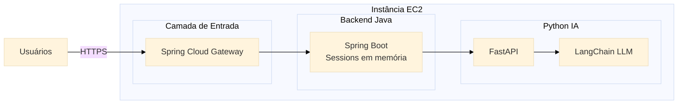

# Archon IA

## Visão Geral

_ArchonIA_ é um chatbot inteligente desenvolvido ainda como um protótipo.
A aplicação permite interação simultânea de vários usuários, mantendo sessões independentes e histórico isolado para cada um.

O sistema combina _Angular, Spring Boot, Spring Cloud Gateway, Python (FastAPI)_ e _LangChain_ para oferecer um fluxo robusto de comunicação com LLMs.
Toda a solução é implantada em uma instância AWS EC2, com endpoint público acessível.

[](https://skillicons.dev)

### Principais Funcionalidades

* Chat multiusuário com sessões separadas por ID único;
* Arquitetura distribuída (Frontend → Gateway → Backend → IA)
* Guardrails e rate limiting via API Gateway
* Respostas geradas por LLM usando LangChain
* Histórico de conversas por sessão (in-memory)
* Deploy completo na AWS EC2
* Documentação e endpoints públicos

## Tecnologias Principais

* **Front-end:** Angular
* **Back-end / Orquestração:** Spring Boot
* **Serviço de IA:** FastAPI + LangChain
* **Armazenamento de Sessão:** Redis
* **Contêineres:** Docker / docker-compose
* **Infraestrutura:** AWS EC2

## Arquitetura

A arquitetura do ArchonIA é composta por quatro camadas principais:

1. **Frontend Angular** – Interface onde o usuário envia mensagens e recebe respostas.

2. **API Gateway (Spring Cloud Gateway)** – Aplica guardrails, rate limiting e roteamento das requisições.

3. **Backend Spring Boot** – Gerencia sessões, histórico por usuário e coordena o fluxo entre frontend e serviço de IA.

4. **Serviço de IA Python (FastAPI + LangChain)** – Processa perguntas e gera respostas usando um modelo LLM.

Toda a solução é implantada em uma única instância AWS EC2, garantindo acesso público via endpoint exposto e comunicação interna entre os serviços.

## Arquitetura UML

A arquitetura UML do ArchonIA representa a interação entre os quatro principais módulos do sistema: _Frontend Angular_, _API Gateway (Spring Cloud Gateway), Backend Java (Spring Boot)_ e Serviço de IA em _Python (FastAPI + LangChain)_.
O objetivo é garantir comunicação eficiente entre os componentes, isolamento de sessões, aplicação de regras de segurança (_guardrails_) e distribuição das requisições entre usuários simultâneos.

O diagrama apresenta:

* A entrada das requisições pelo _frontend_
* O processamento intermediário pelo _Gateway (Rate Limiting + Guardrails)_
* A lógica de sessão e histórico no backend
* O processamento de linguagem natural no microserviço _Python_ com _LangChain_

Essa visão fornece uma perspectiva macro da solução distribuída e modular, permitindo escalabilidade e organização clara dos fluxos.

````mermaid
---
config:
      theme: base
---
flowchart LR
    subgraph Frontend [Angular Frontend]
        UI[Interface Web]
    end

    subgraph Gateway  [Spring Cloud Gateway]
        GL[GuardRails Filter]
        RL[Rate Limiter]
        RT[Routing]
    end

    subgraph Backend[Spring Boot Backend]
        SS[SessionService]
        HC[HistoryController]
        AIProxy[AI Proxy Controller]
    end

    subgraph PythonLLM [Python + LangChain]
        Router[FastAPI Router]
        LLM[LangChain LLM]
        Summarizer[Summarizer]
    end

    UI --> |HTTP Request| Gateway
    Gateway --> Backend
    Backend -->|Requisição de IA|PythonLLM
    PythonLLM --> |Resposta processada| Backend
    Backend --> Gateway
    Gateway --> |HTTP Response| UI
````

## Diagrama de Sequência

O diagrama de sequência demonstra passo a passo o ciclo completo de uma requisição ao ArchonIA:

1. O usuário envia uma mensagem com seu ``session_id``.
2. O _Gateway_ executa _guardrails_ e _rate limiting_.
3. O _Backend_ busca o histórico da sessão e envia a consulta para o microserviço _Python_.
4. O serviço _Python_ processa a mensagem usando o fluxo interno do _LangChain_ e retorna uma resposta gerada pelo modelo LLM.
5. O _backend_ atualiza o histórico e devolve o resultado ao _Gateway_, que repassa ao usuário.

Esse fluxo detalha claramente como o sistema preserva contexto, aplica segurança e mantém o isolamento entre múltiplas sessões simultâneas.
Serve como referência para implementação, _debugging_ e otimização de performance.

````mermaid
---
config:
      theme: base
---
sequenceDiagram
      participant U as Usuário (Angular)
      participant G as Gateway (SCG)
      participant B as Backend (Spring Boot)
      participant P as Python API (FastAPI)
      participant L as LLM (LangChain)

      U->>G: Envia pergunta + session_id
      G->>G: Guardrails + Rate Limiting
      G->>B: Encaminha requisição

      B->>B: Recupera histórico da sessão
      B->>P: Envia pergunta + histórico

      P->>L: Processa com LangChain
      L-->>P: Resposta gerada

      P-->>B: Resposta processada
      B->>B: Atualiza histórico da sessão

      B-->>G: Resposta final
      G-->>U: Envia resposta ao usuário
````

## Diagrama de Implementação AWS

O diagrama de implantação representa como o ArchonIA é distribuído em uma instância AWS EC2, mostrando as camadas de _software_ e fluxo externo de acesso.

A instância EC2 hospeda:

* _Spring Cloud Gateway_, responsável pelo controle de tráfego, segurança e roteamento.
* _Backend Spring Boot_, que gerencia as sessões em memória e coordena o fluxo entre _frontend_ e IA.
* Serviço _Python (FastAPI + LangChain)_, responsável pelo processamento das requisições e geração das respostas com o modelo de linguagem.

Externamente, os usuários acessam o sistema via HTTPS, e o _gateway_ recebe e distribui todas as requisições internas.

Essa visão reflete uma arquitetura simplificada, porém robusta, garantindo escalabilidade vertical, independência entre serviços e controle unificado de entrada por meio do API _Gateway_.



## Endpoints & Protocolos

[Em andamento...]

## Gerenciamento de Sessões (Redis)

[Em andamento...]

## Serviço de IA (FastAPI + LangChain)

[Em andamento...]

## Docker & docker-compose

* **Serviços:** redis, spring, python.

### Exemplo de desenvolvimento e deploy

[Em andamento...]

## Deploy na AWS EC2

[Em andamento...]

## Segurança Básica

* Proteção das chaves de _API_.
* CORS limitado.
* Rate limiting e proteção contra abuso.

## Testes e Validação

[Em andamento...]

## Melhoria e Próximos Passos

* Persistência em DB relacional.
* Resumos automáticos de sessões.
* Dashboard de métricas / latência.

## Estrutura do Repositório

```bash
|- backend/
|- bot/
|- docs/
|- frontend/
README.md
```
**OBS.:** Sujeito a alteração.

## Referências e Créditos

[Em andamento...]